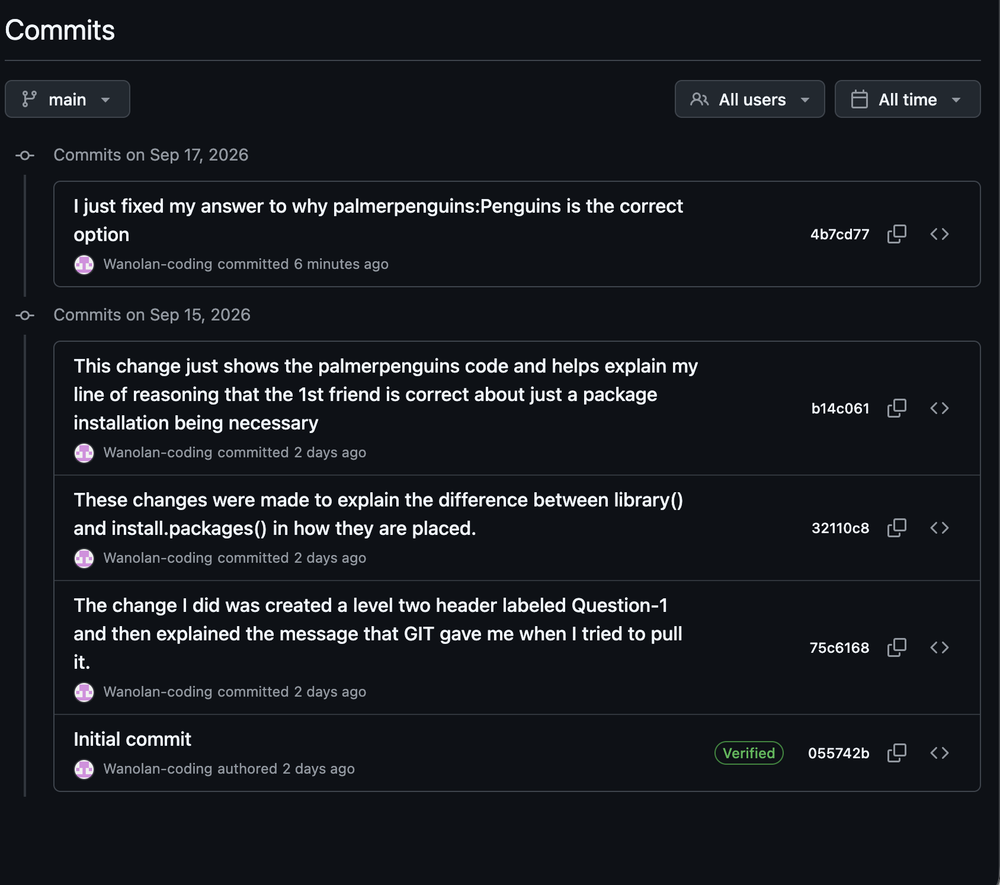

## Question-1

Git gave me the message already up to date. This makes sense because I didn't make any change to the GitHub tab so there was nothing to be applied to the qmd file.

Install.packages should go in the console because this downloads the package once permanently instead of having to install it everytime the code is run which isn't needed for packages.

library() should go in your .qmd file because it needs to be activated on a file by file basis rather than opening the data set permanently on your computer like packages being permanently downloaded through your console.
```{r}
palmerpenguins::penguins
```

The first friend is correct as palmerpenguins::penguins is calling a data set directly from the package that we just installed which doesn't require the use of library. Esspecially considering library is used to access the entirety of package rather than what we need to access, a specific data set called penguins.

```{r,message=FALSE}
library(dplyr)
iris2<-dplyr::arrange(iris,Petal.Length)
head(iris2)
```



